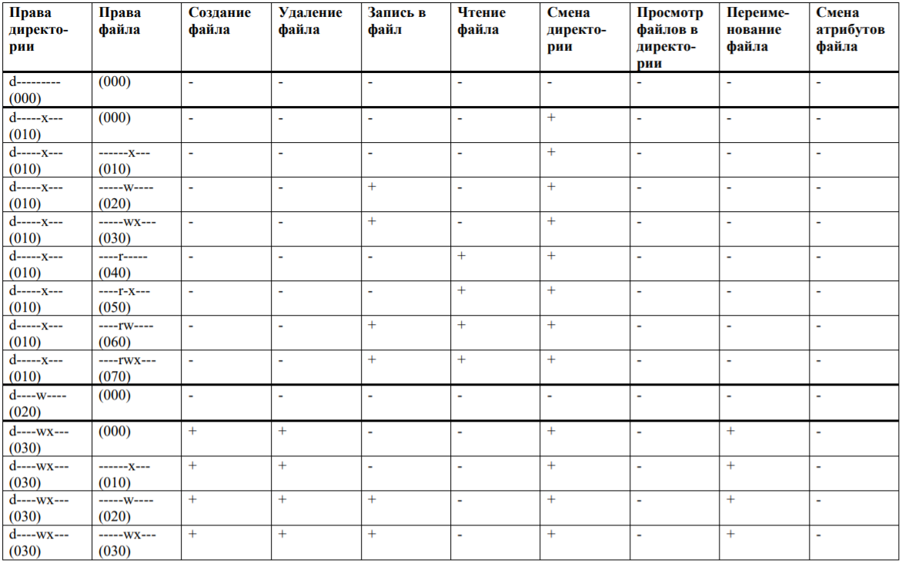
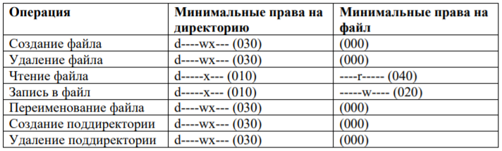

---
# Front matter
title: "Отчет по лабораторной работе №3"
subtitle: "Дискреционное разграничение прав в Linux. Основные атрибуты"
author: "Динькиев Валерий"

# Generic otions
lang: ru-RU
toc-title: "Содержание"

# Bibliography
bibliography: bib/cite.bib
csl: pandoc/csl/gost-r-7-0-5-2008-numeric.csl

# Pdf output format
toc: true # Table of contents
toc_depth: 2
lof: true # List of figures
lot: true # List of tables
fontsize: 12pt
linestretch: 1.5
papersize: a4
documentclass: scrreprt
## I18n
polyglossia-lang:
  name: russian
  options:
	- spelling=modern
	- babelshorthands=true
polyglossia-otherlangs:
  name: english
### Fonts
mainfont: PT Serif
romanfont: PT Serif
sansfont: PT Sans
monofont: PT Mono
mainfontoptions: Ligatures=TeX
romanfontoptions: Ligatures=TeX
sansfontoptions: Ligatures=TeX,Scale=MatchLowercase
monofontoptions: Scale=MatchLowercase,Scale=0.9
## Biblatex
biblatex: true
biblio-style: "gost-numeric"
biblatexoptions:
  - parentracker=true
  - backend=biber
  - hyperref=auto
  - language=auto
  - autolang=other*
  - citestyle=gost-numeric
## Misc options
indent: true
header-includes:
  - \linepenalty=10 # the penalty added to the badness of each line within a paragraph (no associated penalty node) Increasing the value makes tex try to have fewer lines in the paragraph.
  - \interlinepenalty=0 # value of the penalty (node) added after each line of a paragraph.
  - \hyphenpenalty=50 # the penalty for line breaking at an automatically inserted hyphen
  - \exhyphenpenalty=50 # the penalty for line breaking at an explicit hyphen
  - \binoppenalty=700 # the penalty for breaking a line at a binary operator
  - \relpenalty=500 # the penalty for breaking a line at a relation
  - \clubpenalty=150 # extra penalty for breaking after first line of a paragraph
  - \widowpenalty=150 # extra penalty for breaking before last line of a paragraph
  - \displaywidowpenalty=50 # extra penalty for breaking before last line before a display math
  - \brokenpenalty=100 # extra penalty for page breaking after a hyphenated line
  - \predisplaypenalty=10000 # penalty for breaking before a display
  - \postdisplaypenalty=0 # penalty for breaking after a display
  - \floatingpenalty = 20000 # penalty for splitting an insertion (can only be split footnote in standard LaTeX)
  - \raggedbottom # or \flushbottom
  - \usepackage{float} # keep figures where there are in the text
  - \floatplacement{figure}{H} # keep figures where there are in the text
---

# Цель работы

Получение практических навыков работы в консоли с атрибутами файлов для групп пользователей.

# Выполнение лабораторной работы

1. В установленной при выполнении предыдущей лабораторной работы
операционной системе создал учётную запись пользователя guest (использую учётную запись администратора) (рис. -@fig:001)
2. Задал  пароль для пользователя guest (использую учётную запись администратора) (рис. -@fig:001)
3. Аналогично создал второго пользователя guest2. (рис. -@fig:001)
4. Добавил пользователя guest2 в группу guest (рис. -@fig:001)

{ #fig:001 width=90% }

gpasswd -a guest2 guest

5. Осуществил вход в систему от двух пользователей на двух разных консолях: guest на первой консоли и guest2 на второй консоли.(рис. -@fig:002)

6. Для обоих пользователей командой pwd определил директорию, в которой вы находитесь. Сравнил её с приглашениями командной строки.(рис. -@fig:002)

7. Уточнил имя пользователя, его группу, кто входит в неё
и к каким группам принадлежит он сам. Определил командами
groups guest и groups guest2, в какие группы входят пользователи guest и guest2. Сравнил вывод команды groups с выводом команд
id -Gn и id -G.(рис. -@fig:002)

{ #fig:002 width=90% }

8. Сравнил полученную информацию с содержимым файла /etc/group.
Просмотрел файл командой cat /etc/group (рис. -@fig:003)

{ #fig:003 width=90% }

9. От имени пользователя guest2 выполнил регистрацию пользователя
guest2 в группе guest командой (рис. -@fig:004)

{ #fig:004 width=90% }

10. От имени пользователя guest изменил права директории /home/guest,
разрешив все действия для пользователей группы (рис. -@fig:005)

{ #fig:005 width=90% }

11. От имени пользователя guest снял с директории /home/guest/dir1
все атрибуты командой chmod 000 dirl (рис. -@fig:006)

{ #fig:006 width=90% }

12. Заполнил таблицу "Установленные права и разрешенные действия для групп" (рис. -@fig:007)

{ #fig:007 width=90% }

13. Сравнил таблицу. 2.1 (из лабораторной работы № 2) и таблицу. 3.1: различие в том, что даже при наличии у группы полных прав на директорию и на файл группа не 
может менять атрибуты файла.

14. На основании заполненной таблицы определил те или иные минимально необходимые права для выполнения пользователем guest2 операций
внутри директории dirl и заполните таблицу. 3.2 (рис. -@fig:008)

{ #fig:008 width=90% }

# Выводы

Получил практические навыки работы в консоли с атрибутами файлов для групп пользователей.
